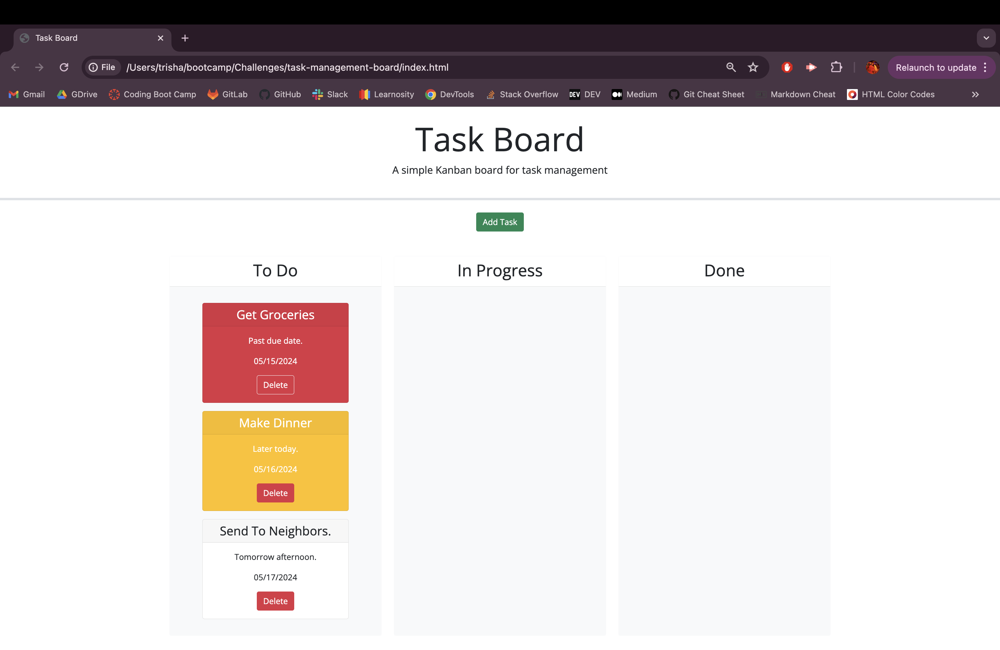

# 📆 Task Management Board

## ✏️ Description

Our task board solution is designed with project team members who are seeking efficient project management. This program easily organizes multiple tasks, tracks progress, and ensures every project stays on target. Say goodbye to scattered to-do lists and hello to streamlined productivity.

Task Board Management Criteria:

    ✔️ Display tasks in columns for different progress states: To Do, In Progress, Done.
    ✔️ Utilize color-coded indicators for task deadlines: Yellow for nearing deadline, Red for overdue.
    ✔️ Enable task creation via modal dialog, capturing Title, Description, and Deadline date.
    ✔️ Ensure task properties persist by saving them in localStorage upon confirmation.
    ✔️ Implement drag-and-drop functionality for updating task progress states.
    ✔️ Provide a deletion feature to remove tasks permanently from the task board.
    ✔️ Guarantee persistence of saved tasks across page refreshes.

## ✏️ Installation and Usage

Click on the "Add Task" button to open a form asking inputs for:

1. Task Title
2. Task Due Date
3. Task Description

🎉 This task board also allows user to drag and drop their task cards to respective lanes: To Do, In Progress, Done!

To run the Task Management Board, you can do either of the following:

* Use the link:
  
  [Task Management Board]()

* Clone the repository:
```
git clone 
```


Below is a preview showing the functionality of the Task Management Board:

[Employee Payroll Tracker Workaround]()





## ✏️ Credits

Credits to the following:

- Classmates
- TA and Instructors
- [Starter Code for the Task Management Board](https://github.com/coding-boot-camp/musical-happiness)
- [Stack Overflow](https://stackoverflow.com/?newreg=f63e9ea2d90e48e6b29cd0118dd59f99)
- [MDN Web Docs](https://developer.mozilla.org/en-US/)
- [Bootstrap](https://getbootstrap.com/)
    - [Modal](https://getbootstrap.com/docs/5.3/components/modal/#how-it-works)
- [jQuery](https://jqueryui.com/)
    - [Datepicker](https://jqueryui.com/datepicker/)
    - [Draggable](https://jqueryui.com/draggable/)
    - [Droppable](https://jqueryui.com/droppable/)


## ✏️ License

This project is licensed under the [MIT License](https://opensource.org/licenses/MIT).


## ✏️ Contributing

If you have any ideas, suggestions, or bug reports, please feel free to open an issue or submit a pull request. Thank you so much! 💕